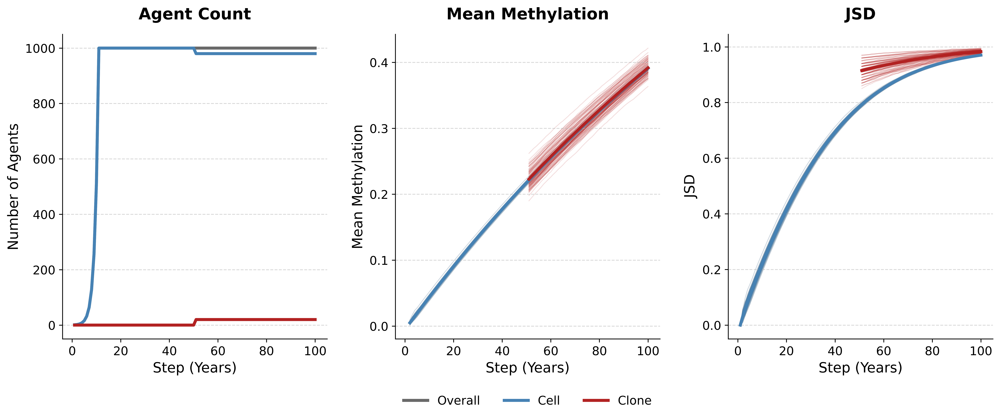
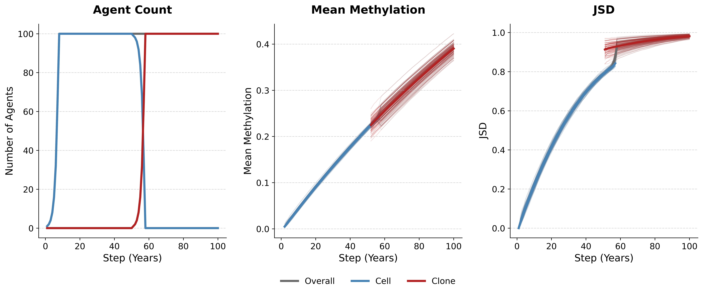
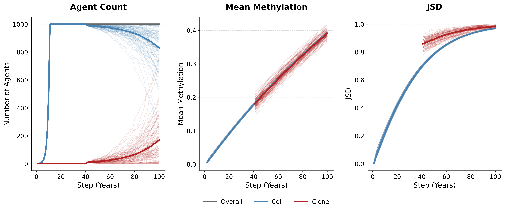
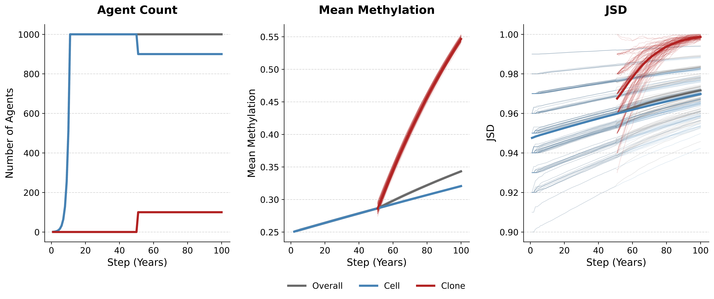

## Agent based model of stochastic methylation during clonal hematopoiesis of indeterminate potential (chip)

**Work-in-progress** experimenting with methylation heterogeneity metrics and ABMs. 

Here is a rewritten version that breaks the dense paragraphs into a highly scannable, logical hierarchy. By separating the agent structure, the timeline of the simulation, and the evolutionary mechanics, it becomes much easier for readers to grasp the entire system at a glance.

## Simulation Overview

The Agent-Based Model (ABM) simulates the epigenetic drift of a hematopoietic cell population over time, culminating in Clonal Hematopoiesis (CH).

**Agent Structure & Epigenetic Drift**
Each `Cell` and `Clone` is mathematically represented as a 2D NumPy array of genes and CpG sites (`n_genes` $\times$ `n_cpgs`). At every simulation step, each CpG site operates under two independent stochastic probabilities:

* `p_meth`: The probability of gaining methylation ($0 \rightarrow 1$).
* `p_unmeth`: The probability of losing methylation ($1 \rightarrow 0$).

### Phases of the Simulation

1. **Developmental Growth:** The model initializes with a single founder `Cell`. This cell duplicates and undergoes methylation drift until the target population size is reached.
2. **Homeostatic Drift:** Once the target size is reached, the population size becomes strictly fixed. Normal `Cells` continue to age and drift stochastically at each step.
3. **CHIP Onset:** At a designated age (`chip_time`), a mutational event is triggered. One or more normal `Cells` are converted into mutant `Clones`.

### Clonal Dynamics & Selection

Following CHIP onset, `Clones` compete with normal `Cells`. Because the population is modeled at a constant capacity, all clonal division is strictly coupled with replacement (a Moran process):

* **Duplication (`p_duplicate`):** A `Clone` divides, and a randomly selected normal `Cell` is removed.
* **Death (`p_die`):** A `Clone` dies, and a randomly selected normal `Cell` divides to fill the empty niche.
* **Neutral (`p_neutral`):** The clone survives but does not net-expand or shrink. Note: `p_neutral` is computed implicitly as $1.0 - (p_{duplicate} + p_{die})$.

The evolutionary fitness of the mutant clone is governed by its selective advantage ($s$):

$$s = p_{duplicate} - p_{die}$$

If $s > 0$, the clone will expand and outcompete normal cells. If $s = 0$, the clone drifts neutrally. If $s < 0$, the clone is selected against and will eventually die off.

### Execution & Outputs

By default, the simulation executes 100 independent iterations. Data across all runs is aggregated into a compressed `.csv` file and automatically processed into plots visualizing population dynamics and methylation heterogeneity over time.

## Set up and run

Install [uv](https://docs.astral.sh/uv/) then:

```
# Clone the repo
git clone https://github.com/jcalendo/chip-methylation-abm.git
cd chip-methylation-abm

# Sync project dependencies with `uv`
uv sync

# Run simulation script and view arguments
uv run main.py --help
```

## Usage

```
usage: main.py [-h] [--runs RUNS] [--n-proc N_PROC] [--n-agents N_AGENTS] [--steps STEPS] 
                [--chip-time CHIP_TIME] [--prop-chip PROP_CHIP] [--n-genes N_GENES] 
                [--n-cpgs N_CPGS] [--p-meth P_METH] [--p-unmeth P_UNMETH] [--init-meth INIT_METH] 
                [--p-meth-clone P_METH_CLONE] [--p-unmeth-clone P_UNMETH_CLONE] 
                [--p-duplicate P_DUPLICATE] [--p-die P_DIE] [--outfile OUTFILE] 
                [--quiet | --no-quiet]

Run the CHIP Methylation Agent-Based Model.

options:
  -h, --help            show this help message and exit
  --runs RUNS           Number of times to repeat the experiment. (default: 100)
  --n-proc N_PROC       Number of processes used for multiprocessing. (default: 4)
  --n-agents N_AGENTS   Total number of cells/agents. Constant population size after growth phase. (default: 1000)
  --steps STEPS         Total number of steps (years) to run the simulation. (default: 100)
  --chip-time CHIP_TIME
                        Step (year) at which the first mutant Clone is introduced. (default: 50)
  --prop-chip PROP_CHIP
                        Proportion of total population that will be turned into Clones at chip_time. (default: 0.02)
  --n-genes N_GENES     Number of genes (rows of CpG matrix) per agent. (default: 100)
  --n-cpgs N_CPGS       Number of CpGs (columns of CpG matrix) per gene. (default: 10)
  --p-meth P_METH       Probability of an unmethylated CpG becoming methylated per step. (default: 0.005)
  --p-unmeth P_UNMETH   Probability of a methylated CpG becoming unmethylated per step. (default: 1e-06)
  --init-meth INIT_METH
                        Initial proportion of CpGs that are methylated at the start of the simulation. (default: 0.0)
  --p-meth-clone P_METH_CLONE
                        Probability of an unmethylated CpG becoming methylated per step in Clones. (default: 0.005)
  --p-unmeth-clone P_UNMETH_CLONE
                        Probability of a methylated CpG becoming unmethylated per step in Clones. (default: 1e-06)
  --p-duplicate P_DUPLICATE
                        Probability of a Clone duplicating. (default: 0.0)
  --p-die P_DIE         Probability of a Clone being replaced by a Cell. (default: 0.0)
  --outfile OUTFILE     Filename to save run results DataFrame to. (default: run_results.csv.gz)
  --quiet, --no-quiet   Do not print program messages. (default: False)
```

## Examples

The current simulation has a lot of arguments to tweak. It's not immediately evident how adjusting these parameters leads to different behaviors. So I'll try to list a few examples to give an idea of what is currently possible.

### Simulating a constant 2% Clonal population size starting at CH onset

2% of Cells are removed at onset of CH and are replaced by exact copies of a selected Clone. These Clones persist until the end of the simulation. Their methylation still drifts but the composition of the population never changes. `--n-proc 12` & `--runs 100` indicates that we will repeat this experiment using the same parameters with different random numbers generator seeds 100 times using 12 parallel processes. 

```{bash}
uv run main.py --prop-chip 0.02 --p-duplicate 0.0 --p-die 0.0 --n-proc 12 --runs 100
```



### Simulating a single Clone at CH onset with exponential Clonal growth

Setting `--prop-chip` to a value that results in a fractional number of Clones at onset will default to a single clone (e.g. 100 agents * 0.001 = 0.1 -> 1 Clone at onset). Once the Clone is initialized it will divide according to its selective advantage. Setting `--p-duplicate 1.0` and `p-die 0.0` ensures that every Clone will always divide into two Clones in the next step (i.e. exponential growth).

```{bash}
uv run main.py --n-agents 100 --prop-chip 1e-6 --p-duplicate 1.0 --p-die 0.0
```



### Simulating 1% Clones at age 40 with a strong selection advantage over Cells

The selection advantage (s) is given by `p_duplicate - p_die`. As stated above, if this value is positive then Clones have a fitness advantage over Cells. There are an infinite number of ways to tune these values to achieve the same value for `s`.

```{bash}
uv run main.py --chip-time 40 --prop-chip 0.01 --p-duplicate 0.25 --p-die 0.2
```



### Simulating different methylation drift/maintenance rates for Cells and Clones

The random chance of methylating or unmethylating a given CpG can be controlled for Cells and Clones independently. The initial methylation state of the founder Cell can also be set to simulate a founder Cell with a proportion methylation != 0.0.

```{bash}
uv run main.py \
  --init-meth 0.25 \
  --prop-chip 0.1 \
  --p-meth 0.001 \
  --p-unmeth 1e-6 \
  --p-meth-clone 0.01 \
  --p-unmeth-clone 0.001
```



